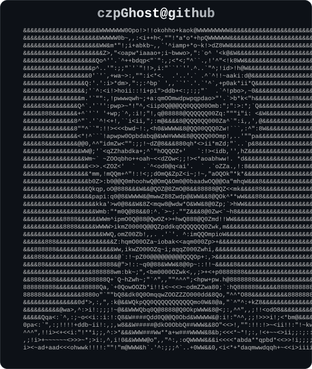

  

  <table><tr>
    <td align="center">
      <picture>
        <source media="(prefers-color-scheme: dark)" srcset="dark_mode.svg" />
        <source media="(prefers-color-scheme: light)" srcset="light_mode.svg" />
        
      </picture>
    </td>
    <td align="center" style="padding: 0 28px;">
      <h2>👋 Hi, I'm Ghost</h2>
      
<em>AI 全栈开发者 Full-Stack AI Developer</em>

      

        
      

      

        
      

      

        
        ·
        
        ·
        
      

    </td>
  </tr></table>

<h3 align="center">📫 Contact</h3>

  <a href="mailto:ghost.czp@gmail.com" style="display:inline-block; margin:4px 10px; vertical-align:middle;">
    &nbsp;<b>ghost.czp@gmail.com</b>
  </a>
  &nbsp;&nbsp;
  <a href="mailto:ghost.czp@outlook.com" style="display:inline-block; margin:4px 10px; vertical-align:middle;">
    &nbsp;<b>ghost.czp@outlook.com</b>
  </a>
  &nbsp;&nbsp;
  <a href="mailto:3213341985@qq.com" style="display:inline-block; margin:4px 10px; vertical-align:middle;">
    &nbsp;<b>3213341985@qq.com</b>
  </a>

  

